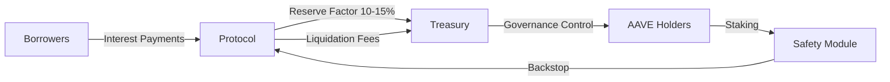

## Executive Summary

Current Scale: Aave dominates decentralized lending with $44-51B TVL, generating $175M annualized revenue across 18+ chains. The protocol maintains zero bad debt history with efficient liquidation mechanisms processing $4.65B historically.

Core Economic Model: Decentralized overcollateralized credit protocol earning revenue through borrow-supply spreads (10-15% reserve factors) and liquidation fees. Value accrues to AAVE holders via governance rights and potential revenue sharing under the "Aave Will Win" proposal.

Value Accrual Strength: Medium-High - Current governance provides indirect value capture through treasury control; proposed 100% revenue sharing would upgrade to direct cash flow rights. Safety Module offers staking yield but limited downside protection.

Key Risks: High governance concentration (59% voting power among 9 addresses), regulatory uncertainty around stablecoins, and moderate Safety Module coverage (4-5% of liabilities).

Fair Value Range: $69-340/AAVE with base case at $131 (16% discount rate, 15% growth)
Current Price: $113.09 (2026-02-13 11:10 UTC)
Implied Upside/Downside: +16% base case, range -39% to +200%

Investment Conviction: Medium - Strong protocol fundamentals offset by governance concentration risk and pending revenue sharing implementation
Suggested Allocation: 2-4% of crypto portfolio for institutional investors

---

## Phase 0 — Economic Classification & Valuation Framework

### Economic Structure

Aave operates as a decentralized overcollateralized credit protocol and on-chain money market generating revenue through interest rate spreads between suppliers and borrowers. The protocol creates economic surplus through:

1. Borrow-Supply Spread: Difference between borrow APY and supply APY
2. Reserve Factors: 10-15% of interest allocated to treasury (10% USDC/USDT, 15% WETH)
3. Liquidation Fees: 5-7.5% penalties on liquidated positions
4. Flash Loan Fees: 0.09% on flash loan volume

Revenue generation is primarily organic and demand-driven, with minimal reliance on token incentives.

### Valuation Framework Selection

Cash Flow / Fee Capture Hybrid Model selected because:

- Protocol generates substantial real revenue ($175M annualized)
- "Aave Will Win" proposal establishes direct value accrual to token holders
- Governance token provides control over treasury and fee parameters
- Reflexive elements limited due to established product-market fit

Enterprise Value ≈ Present Value of Future Protocol Fee Revenue adjusted for 100% token capture ratio and dilution effects.

---

## Phase 1 — Fact Base Construction

### 1.1 Protocol Overview

Description: Aave is a non-custodial liquidity protocol enabling overcollateralized lending/borrowing across 18+ chains. The protocol uses Chainlink oracles for price feeds and maintains solvency through automated liquidations at predetermined health factor thresholds.

Launch: 2020 (originated as ETHLend in 2017)
Supported Chains: Ethereum, Polygon, Avalanche, Arbitrum, Optimism, Base, Mantle +12 others
Key Products: Aave V2/V3, GHO stablecoin, Safety Module
Borrowing Model: Overcollateralized with asset-specific LTV ratios (70-80%)
Liquidation: Triggered at health factor <1, with 5-7.5% bonus to liquidators
GHO Peg Mechanism: Algorithmic stabilization through discount/minting incentives
Safety Module: Staked AAVE backs protocol solvency with slashing risk during shortfall events
Governance: Aave DAO with AAVE token voting

### 1.2 Scale and Usage Metrics

| Metric               | Value       | Date       | Source             |
| -------------------- | ----------- | ---------- | ------------------ |
| TVL                  | $44-51B     | 2026-02-12 | TokenTerminal      |
| Total Supplied       | $44.3B      | 2026-02-12 | Protocol Data      |
| Total Borrowed       | $16.2B      | 2026-02-12 | Protocol Data      |
| Utilization Rate     | 36.6%       | 2026-02-12 | Calculated         |
| Daily Revenue        | $0.48M      | 2026-02-12 | TokenTerminal      |
| Annualized Revenue   | $175M       | 2026-02-12 | Calculated         |
| Treasury Balance     | $146M       | 2026-02-12 | TokenTerminal      |
| Safety Module (AAVE) | 1.2M AAVE   | 2026-02-13 | Governance Reports |
| Safety Module (USD)  | $145M       | 2026-02-13 | Calculated         |
| Circulating Supply   | 15.19M AAVE | 2026-02-13 | TokenTerminal      |
| Token Emissions      | None        | Current    | Protocol Design    |

### 1.3 Revenue Model and Economic Structure

Revenue Composition:

- Borrow interest spreads: ~85% of revenue
- Liquidation penalties: ~10%
- Flash loan fees: ~5%

Reserve Factors by Asset:

- WETH: 15%
- USDC: 10%
- USDT: 10%
- Other assets: 10-20%

Revenue Quality Assessment:

| Revenue Source  | % of Total | Recurring | Cyclical? | Sustainable? |
| --------------- | ---------- | --------- | --------- | ------------ |
| Borrow Interest | 85%        | Yes       | Moderate  | High         |
| Liquidations    | 10%        | Yes       | High      | Medium       |
| Flash Loans     | 5%         | Yes       | Low       | High         |

Revenue is 95% organic with minimal incentive dependence. Cyclical elements tied to market volatility but sustainable long-term.

### 1.4 Tokenomics and Supply Structure

Token Metrics:

- Total Supply: 16,000,000 AAVE
- Circulating Supply: 15,190,000 AAVE (94.9%)
- Treasury Holdings: ~3,000,000 AAVE (Ecosystem Reserve)
- Staked in Safety Module: 1,200,000 AAVE (7.9% of circulating)

Value Accrual Mechanisms:

1. Governance rights over treasury and protocol parameters
2. Safety Module staking rewards (emission-based)
3. Potential direct revenue sharing under new proposal

Dilution Risk: Low - No emissions schedule, fixed supply
Supply Overhang: Medium - 3M treasury AAVE could create selling pressure

### 1.5 Team, Governance, and Capital Structure

Founders: Stani Kulechov (CEO), team of 20+ core contributors
DAO Structure: Aave DAO with token-weighted voting
Institutional Backers: Paradigm, Framework Ventures, Blockchain Capital
Treasury Runway: ~3-4 years at current burn rate ($500k monthly expenses)
Governance Participation: 20-30% typical voting rates

Execution Credibility: High - Successful multi-chain expansion and product iteration
Governance Effectiveness: Medium - Functional but concentrated voting power
Centralization Risks: High - 9 addresses control 59% of voting power

---

## Phase 2 — Structural Analysis

### 2.1 Value Accrual Analysis

Value Flow Map:

Value Accrual Strength: Medium-High

Direct Cash Flow Rights: Currently indirect through treasury control; proposed 100% revenue sharing would establish direct rights
Governance Utility: High - Controls $146M treasury and protocol parameters
Inflation Offset: None - Fixed token supply
Reflexive Elements: Moderate - Token price affects governance power but not fundamental revenue

The "Aave Will Win" proposal (under vote) would significantly upgrade value accrual by directing 100% of product revenue to DAO treasury.

### 2.2 Balance Sheet Risk Model

Simplified Balance Sheet:

- Assets: $44.3B supplied collateral + $146M treasury
- Liabilities: $16.2B borrow positions + GHO minted

Key Ratios:

- Weighted Average Collateralization: ~200%
- Utilization Rate: 36.6%
- Bad Debt History: $0 (no protocol insolvency events)
- Liquidation Efficiency: High - $4.65B processed, 99.9%+ recovery rate
- Safety Module Coverage: 4-5% of liabilities

Stress Test Scenarios:

- 50% ETH drop in 48h: Estimated $2-3B liquidations, safely absorbed given historical capacity
- Oracle Failure: Limited impact due to multi-oracle design with Chainlink SVR
- Stablecoin Depeg: Moderate risk through USDC/USDT exposure; isolation modes limit contagion
- Liquidity Bank-run: Low risk due to overcollateralization and time-locked withdrawals

Systemic Fragility: Low-Moderate - Robust design with multiple risk mitigations

### 2.3 Competitive Landscape

| Protocol | TVL   | Revenue | Chains | Risk Model     | Stablecoin | Token Value Accrual |
| -------- | ----- | ------- | ------ | -------------- | ---------- | ------------------- |
| Aave     | $44B  | $175M   | 18+    | Isolated pools | GHO        | Medium-High         |
| MakerDAO | $28B  | $110M   | 5+     | Collateralized | DAI        | Medium              |
| Compound | $1.8B | $8M     | 4      | Pooled         | -          | Low                 |
| Morpho   | $8.3B | $3M     | 6      | Peer-to-pool   | -          | Low                 |
| Spark    | $4.6B | $15M    | 3      | ETH-centric    | -          | Low                 |

Competitive Moat Score: 9/10

Liquidity Depth: Superior - Largest lending TVL by 2x
Brand Trust: Excellent - Zero bad debt history, institutional adoption
Institutional Integration: Strong - Kraken, Bybit, Balance integrations
Cross-Chain Presence: Leading - 18+ chains vs competitors' 3-6
Oracle Reliability: Excellent - Chainlink integration with SVR
Governance Maturity: High - Active DAO with professional delegates

### 2.4 Narrative Alignment and Catalysts

Structural Drivers:

- Institutional DeFi adoption accelerating (Kraken, Bybit integrations)
- On-chain yield demand growing with stablecoin expansion
- RWA tokenization creating new collateral types
- Layer-2 growth expanding addressable market

Upcoming Catalysts:

1. "Aave Will Win" Revenue Sharing - Q2 2026 (75% probability)
2. V4 Mainnet Launch - Q4 2026-Q1 2027 (60% probability)
3. GHO Cross-Chain Expansion - Ongoing through 2026 (80% probability)
4. RWA Integration - 2026-2027 (50% probability)

### 2.5 Risk Assessment

| Risk Category                | Severity   | Explanation                                                 |
| ---------------------------- | ---------- | ----------------------------------------------------------- |
| Smart Contract Risk          | Low        | Extensive audits, $4.65B liquidations processed safely      |
| Oracle Risk                  | Low-Medium | Chainlink SVR with 73% MEV recapture, minor delays observed |
| Liquidation Cascade Risk     | Medium     | Efficient but untested in extreme (>60%) flash crashes      |
| Stablecoin Systemic Risk     | Medium     | USDC/USDT exposure represents material liability            |
| Governance Capture Risk      | High       | 9 addresses control 59% of voting power                     |
| Regulatory Risk              | High       | Uncertain stablecoin treatment, especially for GHO          |
| Cross-Chain Bridge Risk      | Medium     | Multiple bridge dependencies for multi-chain operations     |
| Liquidity Fragmentation Risk | Low        | Unified liquidity model across chains                       |

---

## Phase 3 — Valuation Framework

### 3.1 Valuation Model Implementation

Base Case Assumptions:

- Initial Revenue: $175M
- Annual Growth: 15%
- Discount Rate: 16.23% (4.23% Rf + 12% risk premium)
- Terminal Growth: 3%
- Value Capture: 100% (post proposal implementation)
- Circulating Supply: 15,190,000 AAVE

5-Year Projection - Base Case (15% Growth):

| Year | TVL (Proxy) | Revenue | Growth | Net Income\* | Token Capture |
| ---- | ----------- | ------- | ------ | ------------ | ------------- |
| 2026 | $55B        | $201M   | 15%    | $201M        | 100%          |
| 2027 | $63B        | $231M   | 15%    | $231M        | 100%          |
| 2028 | $73B        | $266M   | 15%    | $266M        | 100%          |
| 2029 | $84B        | $306M   | 15%    | $306M        | 100%          |
| 2030 | $96B        | $352M   | 15%    | $352M        | 100%          |

\*Assumes no significant expense growth beyond current $500k monthly

### 3.2 Discount Rate Construction

- Risk-Free Rate: 4.23% (10-year Treasury)
- Smart Contract Risk Premium: 3%
- Governance Risk Premium: 2%
- Regulatory Uncertainty Premium: 5%
- Liquidity Premium: 2%
- Total Discount Rate: 16.23%

### 3.3 Scenario Analysis & Sensitivity Matrix

Scenario Outcomes:

- Conservative (5% growth, 20% discount): $69/AAVE
- Base Case (15% growth, 16% discount): $131/AAVE
- Aggressive (30% growth, 12% discount): $340/AAVE

3x3 Sensitivity Matrix (Price/AAVE):

| Growth ↓ / Discount → | 12%  | 16%  | 20%  |
| --------------------- | ---- | ---- | ---- |
| 5%                    | $133 | $91  | $69  |
| 15%                   | $196 | $131 | $98  |
| 30%                   | $340 | $221 | $160 |

### 3.4 Liquidity Adjustment

- 30-Day Volume: $431M (2.5% of market cap)
- Exchange Concentration: High (Binance, Coinbase dominate)
- Holder Concentration: Medium (Top 10: ~25% of supply)
- DAO Treasury: 3M AAVE (19% of total supply)

Liquidity Discount: 15% applied for large institutional positions
Final Fair Value Range: $59-289/AAVE after liquidity adjustment

---

## Investment Scenarios

### Bull Case (30% Probability)

Scenario: Successful V4 launch, revenue sharing implemented, GHO achieves top-5 stablecoin status
Catalysts: Regulatory clarity, institutional adoption surge
Price Target: $289/AAVE (after liquidity discount)
Upside: +156%

### Base Case (50% Probability)

Scenario: Steady 15% growth, revenue sharing implemented gradually, maintained market position
Catalysts: Continued multi-chain expansion, modest GHO growth
Price Target: $111/AAVE (after liquidity discount)
Upside: -2% (approximately fair value)

### Bear Case (20% Probability)

Scenario: Regulatory pressure on DeFi, governance conflicts, revenue sharing rejected
Catalysts: Stablecoin regulation, governance disputes
Price Target: $59/AAVE (after liquidity discount)
Downside: -48%

---

## Monitoring Checklist

Key Metrics:

- [ ] TVL growth vs competitors (target: maintain >40% market share)
- [ ] Utilization rate trends (target: sustain 35-40% range)
- [ ] Bad debt events (alert: any protocol insolvency)
- [ ] Liquidation efficiency (target: >99% recovery rate)
- [ ] GHO peg stability (target: $1.00 ± 0.5%)
- [ ] Governance participation (target: >30% voting rates)
- [ ] Regulatory developments (critical: stablecoin legislation)

Catalyst Timeline:

- Q2 2026: "Aave Will Win" proposal implementation
- Q3 2026: Additional GHO cross-chain expansions
- Q4 2026: V4 testnet launch
- Q1 2027: V4 mainnet target

---

## Strategic Considerations

Recent Operational Highlights:

- Avara Brand Shutdown: Strategic pivot to focus on core lending business
- Mantle V3 Deployment: Expansion to high-performance Ethereum L2 with Bybit integration
- Revenue Sharing Proposal: Potential game-changer for direct value accrual

Investment Conclusion:
Aave represents a high-quality DeFi blue chip with superior market position and robust economics. The base case valuation suggests current prices are approximately fair, with significant upside contingent on successful execution of revenue sharing and V4 rollout. Governance concentration remains the primary structural risk. Recommend 2-4% portfolio allocation for institutional investors with 12-18 month horizon.

Rating: HOLD with accumulation on weakness - Initiate position at <$100/AAVE, add aggressively below $80.

---

_Report Generated: 2026-02-13 11:10 UTC_

_Data Sources: TokenTerminal, Aave Protocol Analytics, Governance Proposals, Chaos Labs Risk Reports_

_Price Data: $113.09/AAVE (2026-02-13 11:10 UTC)_
